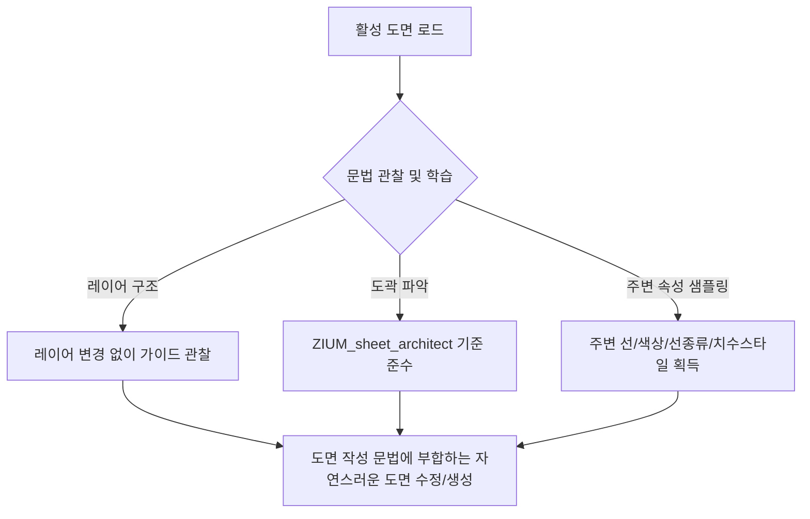

# 18. 도면 작성 문법 학습 베이스라인 지침서
(Drawing Grammar Learning Baseline Guide)

> [!NOTE]
> 본 문서는 단순한 "특정 도면의 분석 리포트"가 아닙니다. 실무 도면(서대신동 상가주택 등)의 분석을 통해 **건축 도면이 어떻게 작성되었는가**에 대한 문법적 구조를 파악하고, 향후 AI가 새로운 요소를 그리거나 수정할 때 기준이 되는 **도면 작성 가이드라인 및 문법 베이스라인**으로 작성되었습니다.

---

## 1. 패러다임의 전환: 도면의 강제 수정에서 '문법 학습'으로

기존 CAD 수정 엔진이 레이어를 강제 표준화하거나 일관된 블록 이름을 강요했던 것과 달리, 지움건축(ZIUM) 도면 엔진은 다음과 같은 실무 밀착형 원칙을 기반으로 도면 작성 문법을 학습하고 적용합니다.



### 1) 레이어 무변경 및 관찰 정보 활용 (Layer Integrity)
* **원칙**: 도면 내의 기존 레이어(예: `wall1`, `중심선`, `치수`)를 임의로 삭제하거나 통합 변경하지 않습니다.
* **적용**: 기존 레이어의 명칭과 포함된 요소들을 **관찰 데이터(Context)**로만 사용합니다. 새로운 벽체를 그릴 때는 도면에 이미 조율되어 있는 `wall1` 또는 `WALL1` 레이어를 식별하여 그 위에 얹는 방식을 채택합니다.

### 2) 도곽 블록 재사용 및 자동 좌표계 바인딩 (Title Block Reuse)
* **원칙**: 신규 도면 요소나 시트를 배치할 때 임의의 도곽선을 작성하지 않고, 도면 내의 활성 도곽 블록(예: `ZIUM_sheet_architect`)을 탐색하여 해당 도곽의 원점(Origin) 및 스케일을 좌표계의 기준으로 삼습니다.
* **적용**: 지움 도면 안에서 도곽 블록이 갖는 위치와 도면 명칭 정보를 학습하여 타이틀을 매핑합니다.

### 3) 주변 속성 샘플링 (Drafting Attributes Sampling)
* **원칙**: 신규 드로잉 요소의 색상, 선종류, 선가중치, 문자높이, 치수스타일은 전역 설정을 따르지 않고, **작성 위치 주변의 개체들을 샘플링(Query Neighboring Styles)**하여 완벽하게 맞춥니다.
* **적용**: 중심선 레이어 부근에 새로 그릴 때는 해당 레이어의 Dominant 속성(빨간색, `CEN2` 선종류)을 가져오고, 치수선을 그릴 때는 주변 치수선 스타일인 `300DIM`을 자동 바인딩합니다.

---

## 2. 서대신동 상가주택에서 학습한 표준 문법 베이스라인

실시간 ZWCAD 데이터베이스 덤프와 스타일 샘플러를 통해 학습된 지움건축의 실무 도면 문법은 다음과 같습니다.

### 1) 구조 및 벽체 드로잉 문법 (Structure & Wall Grammar)
* **기둥 및 주 구조**: `COL`, `COLU` 레이어에 **색상 2 (Yellow)**, **실선 (Continuous)** 속성을 가집니다.
* **벽체 표기**: `WALL1` 레이어 역시 **색상 2 (Yellow)**와 **실선**을 사용하여 기둥과 벽체의 구조적 일치성을 보여줍니다.
* **옹벽 표기**: `옹벽` 또는 특수 기둥 채우기(`COL XX1` 등)에는 색상 **`251` (어두운 회색)**을 사용하여 구조 평면 상의 재질 분리를 명확히 표현합니다.

### 2) 기하 격자 및 가이드 문법 (Grid & Centerline Grammar)
* **중심선**: `중심선` 레이어에 배치되며, 색상은 **`1` (Red)**, 선종류는 축척 비율에 최적화된 **`CEN2` (Center 2)**를 사용하여 도면 가독성을 극대화합니다.

### 3) 문자 스타일 및 주석 높이 문법 (Text & Annotation Grammar)
* **사용 폰트 및 스타일**: 지움건축 표준 서체인 **`지움EB (EB)`** 스타일을 active 서체로 적용하고 있습니다.
* **텍스트 크기 표준**:
  * 실명 및 구획 텍스트 (예: `401호`, `안방`, `거실`): 도면 축척(1:300 등)을 고려하여 **`250.0 mm`** 높이를 기준으로 삼습니다.
  * 지시선 및 일반 주석: **`150.0 mm`** 높이의 텍스트가 지배적으로 사용됩니다.

### 4) 치수 기입 스타일 문법 (Dimensioning Grammar)
* **치수 스타일**: 전용 스타일인 **`300DIM`** 스타일을 사용하며, 치수선과 치수보조선은 레이어 default 색상인 **`7` (White/Black)**을 사용하여 구조선과 혼동되지 않도록 합니다.

---

## 3. 문법 학습 적용 시나리오 예시

향후 AI가 새로운 구획선이나 발코니 축소 등 설계 변경을 가할 때, 본 Baseline에 근거하여 다음과 같이 작동합니다.

```python
# 1. 주변 문법 스타일 템플릿 로드
with open("generated/sampled_drawing_grammar.json", "r", encoding="utf-8") as f:
    grammar = json.load(f)

# 2. 중심선을 연장해야 하는 경우
# 임의의 레이어와 색상을 지정하는 대신 샘플링한 문법을 적용:
new_centerline = {
    "action": "create_line",
    "layer": "중심선",
    "color": grammar["중심선"]["color"],          # 1 (Red) 적용
    "linetype": grammar["중심선"]["linetype"],    # CEN2 적용
    "start": [x1, y1, 0],
    "end": [x2, y2, 0]
}
```

이 문법 베이스라인은 도면이 바뀔 때마다 해당 도면의 고유한 컨텍스트(축척, 폰트 종류, 해치 패턴)를 존중하는 **"맥락 인식형(Context-Aware) 드로잉 엔진"**의 기초가 됩니다.
