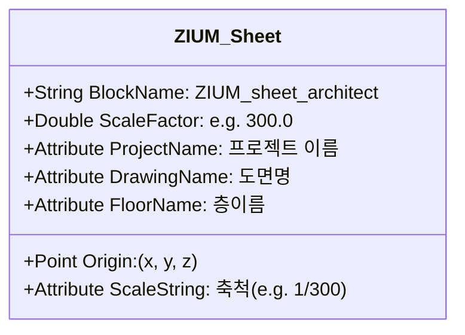

# 19. 지움 도각 및 선 표현 문법 지침서
(ZIUM Sheet and Line Grammar Guide)

> [!IMPORTANT]
> 본 지침서는 지움건축(ZIUM Architects)만의 고유한 도면 도곽(Title Sheet) 활용 규격과 도면의 뼈대를 이루는 선 표현(Line Grammar) 스타일을 체계화한 규격서입니다. 도면 자동 수정 및 생성 엔진은 이 규격을 기준으로 모든 시각 속성을 조율합니다.

---

## 1. 도곽 및 블록 속성 표현 문법 (Title Sheet Grammar)

지움건축 도면에서 도곽은 정밀한 좌표 정의와 도면 관리를 위한 핵심 컴포넌트입니다.

### 1) 도곽 블록 식별 및 좌표 바인딩 규칙
* **식별자**: 도면 내에 정의된 `ZIUM_sheet_architect` 또는 유사 명칭의 도각 블록을 탐색합니다.
* **원점 보존**: 도각의 삽입점(Insertion Point)을 도면 영역의 물리적 원점 `(0, 0, 0)`으로 인식하고, 모든 내부 주거 구획 좌표계를 해당 삽입점 기준의 상대 좌표로 계산합니다.
* **스케일 연동**: 도각 블록의 X/Y 축척값(Scale Factor)을 추출하여, 신규 기입할 치수의 크기(DimScale) 및 텍스트 높이에 곱해줌으로써 도곽 축척과 도면 요소의 축척을 100% 일치시킵니다.
  * 예: 도곽 블록 스케일이 `300.0`인 경우, 문자 높이 `2.5mm` (도면 기준 `750.0mm`)로 자동 스케일링.

### 2) 도각 텍스트 정보의 문법적 업데이트
* 도곽 내부의 선이나 격자는 직접 수정하지 않으며, 도각 블록 내에 내장된 **속성 정의(Attributes)**만을 수정합니다.
  * **프로젝트명(Project Name)**: `부산광역시 서구 서대신동3가 상가주택`
  * **도면 번호 및 날짜**: 기존 속성 필드의 문자 값을 갱신하여 도면 정합성을 보장합니다.

---

## 2. 선 및 기하 속성 매칭 문법 (Line Attribute Grammar)

신규 요소를 그릴 때는 도면에 정의된 레이어 속성 테이블(`sampled_drawing_grammar.json`)을 1순위로 조회하여 **ByLayer** 값에 수렴하게 드로잉합니다.

| 레이어 (Layer) | 색상 인덱스 (Color) | 선종류 (Linetype) | 선가중치 (Lineweight) | 주 용도 |
| :--- | :---: | :--- | :--- | :--- |
| **WALL1** (벽체) | `2` (Yellow) | `Continuous` | `ByLayer` (`-3`) | 평면상 벽체 구조선 |
| **COL** (기둥) | `2` (Yellow) | `Continuous` | `ByLayer` | 철근콘크리트 기둥 구조체 |
| **COL XX1** (기둥 채우기) | `251` (Dark Gray) | `Continuous` | `ByLayer` | 기둥 솔리드 해치 및 마감 경계 |
| **중심선** | `1` (Red) | `CEN2` (Center 2) | `ByLayer` | 도면의 그리드 기준선 |
| **치수** | `7` (White) | `Continuous` | `ByLayer` | 치수선, 보조선, 치수 텍스트 |

---

## 3. 문자 높이 및 치수 스타일 바인딩 문법

### 1) 텍스트 높이 문법 (Text Height Grammar)
지움 도면의 가독성을 유지하기 위한 텍스트 계층 구조는 다음과 같습니다:

* **1등급 (대제목 / 층이름 / 도곽명)**:
  * 기준 크기: `5.0mm` (1:300 축척에서 **`1500.0 mm`**)
  * 스타일: `지움EB` (두꺼운 볼트체)
* **2등급 (실 이름 / 구획 표기 - 안방, 거실 등)**:
  * 기준 크기: `0.83mm` (1:300 축척에서 **`250.0 mm`**)
  * 스타일: `지움EB` 또는 active text style
* **3등급 (일반 주석 / 지시선 설명)**:
  * 기준 크기: `0.5mm` (1:300 축척에서 **`150.0 mm`**)

### 2) 치수 기입 문법 (Dimensioning Grammar)
* **치수 스타일 강제**: 새로 기입하는 치수는 반드시 현재 도면 내에 존재하는 **`300DIM`** 스타일을 상속받아야 합니다.
* **ByLayer 치수**: 치수선의 색상과 문자 색상을 강제 오버라이드(Override)하지 않고, `치수` 레이어의 기본 색상 **`7` (White)**에 동기화되도록 드로잉 모듈을 제어합니다.

---

## 4. 문법적 도면 생성 흐름 지침 (Drafting Execution Rules)

새로운 도면 수정 요청(예: 발코니 축소 및 내벽선 이동)이 있을 때 AI 드로잉 모듈은 아래 단계를 순차적으로 따릅니다:

1. **도각 탐색**: 현재 도곽(`ZIUM_sheet_architect`)의 존재 여부와 삽입점을 읽어 스케일(`300.0`)을 획득합니다.
2. **레이어 조회**: 도면 내에 존재하는 벽체용 레이어(`WALL1` 등)를 확인합니다. 레이어를 새로 만들지 않고 기존 `WALL1` 레이어로 드로잉 대상을 세팅합니다.
3. **주변 선 스타일 샘플링**: `WALL1` 레이어의 색상이 `2 (Yellow)`임을 인식하고, 신규 벽체 폴리라인 생성 시 `Color: 256` (ByLayer) 및 `Linetype: ByLayer`를 세팅하여 완벽한 시각적 통합을 이룹니다.
4. **문자 기입 시 스타일 매칭**: `글씨` 또는 `평면` 레이어를 식별하고, 해당 레이어가 지정하는 `지움EB` 서체와 `250.0` 높이 규격으로 텍스트 요소를 생성합니다.
