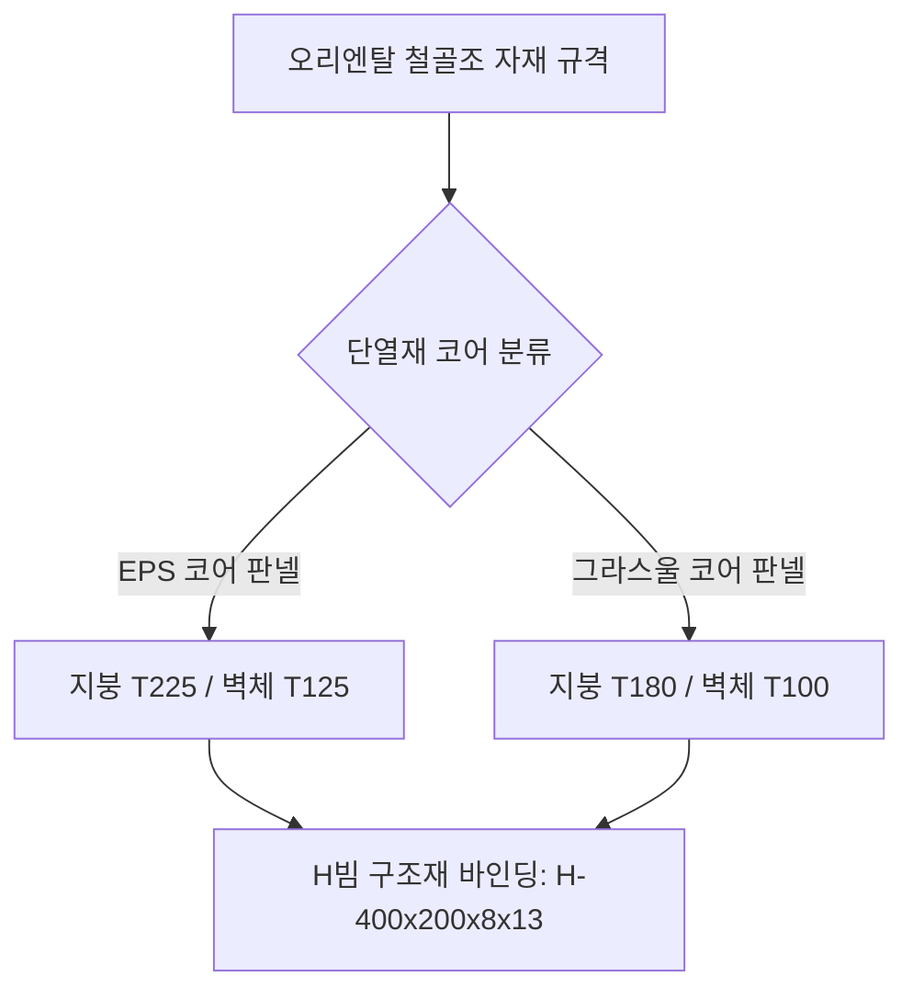

# 20. 오리엔탈 철골구조 및 패널 자재 표현 문법
(Oriental Steel Structure & Panel Material Grammar Guide)

> [!NOTE]
> 본 지침서는 실제 완공 및 실시설계가 완료된 **"오리엔탈 공장"** 도면의 데이터베이스에서 추출한 형강 규격과 실제 소방/건축 단열 기준을 반영하여, **그라스울 판넬 두께 표준(지붕 T180, 벽체 T100)** 및 **H빔의 공학적 도면 작도(평면 및 단면) 문법**을 정의한 마스터 지침서입니다.

---

## 1. 지음건축 철골구조(S조) 단열 규격 학습 테이블

건축 외피 자재가 **그라스울 판넬(Glasswool Panel)**일 때와 **EPS 판넬**일 때의 부재별 두께 문법은 법적 내화/단열 규정에 맞춰 다음과 같이 엄격하게 구분하여 설계 평면 및 단면에 반영합니다.



### 1) 그라스울 판넬 표준 스펙 (Glasswool Standards)
* **지붕 판넬 두께**: **`T 180 (THK 180)`**
  * **지표**: `T180 그라스울 판넬(지붕)` / `T180 난연 그라스울 지붕판넬`
  * **용도**: 화재 확산 방지 및 최상층 단열 성능 동시 확보
* **벽체 판넬 두께**: **`T 100 (THK 100)`**
  * **지표**: `T100 그라스울 벽판넬` / `T100 그라스울 사이딩판넬`
  * **용도**: 외벽용 볼트리스 또는 종방향 메탈 그라스울 판넬

### 2) EPS 판넬 표준 스펙 (EPS Standards - 기존 학습 데이터)
* **지붕 판넬 두께**: **`T 225`** (`THK225 EPS(준불연) 판넬`)
* **벽체 판넬 두께**: **`T 125`** (`THK125 EPS(준불연) 1000골판넬 / 사이딩판넬`)

---

## 2. H형강(H-Beam) 표준 규격 사전

오리엔탈 도면에서 추출된 표준 형강 규격과 공학적 용도는 다음과 같으며, 신규 구조물이나 브래킷 작성 시 본 부재 사전을 기준으로 치수를 자동 생성합니다.

| 부재 분류 | 표준 형강 치수 (H x B x t1 x t2) | 공학적 용도 및 비고 |
| :--- | :--- | :--- |
| **주 기둥 (Main Column)** | **`H-400 x 200 x 8 x 13`** | 공장 외벽 및 중심부 구조 기둥 (Momemt Frame) |
| **보 / 서까래 (Beam / Rafter)** | **`H-400 x 200 x 8 x 13`** | 지붕 하중 지지 및 스팬 연결용 Rafter 형강 |
| **작은 보 (Sub-Beam)** | **`H-300 x 150 x 6.5 x 9`** | 내부 사무동 보 및 국부 보강용 |
| **중도리 (Purlin)** | **`C-150 x 65 x 20 x 2.3`** | 지붕 판넬(T180) 고정용 Z 또는 C형강 (간격 600~750) |
| **띠장 (Girt)** | **`C-100 x 50 x 20 x 2.3`** | 외벽 판넬(T100) 고정용 C형강 |

---

## 3. H빔의 평면도(Plan View) 작도 및 표현 문법

H빔 기둥은 중심선(`중심선` 레이어, 색상 1, 선종류 CEN2)의 교차점에 센터를 맞추어 작도하며, 다음의 그래픽 규칙을 엄격히 준수합니다.

```
                     H-400x200 Column (COL Layer)
                     
                     <--- Flange Width: 200 --->
                     +========================+  ^
                     |   ■■■■■■■■■■   |  | Flange Thickness: 13
                     +--+     +======+     +--+  v
                        |     | Web: 8        |
      ------------------|  *  |---------------|----------- Grid (중심선)
                        |     |               |
                     +--+     +======+     +--+  ^
                     |   ■■■■■■■■■■   |  | Flange Thickness: 13
                     +========================+  v
                     | <---- Height: 400 ---->|
```

### 1) 평면도 작도 규칙
* **레이어 바인딩**: H빔 형강 외곽선은 반드시 **`COL`** 또는 `A-COL` 레이어로 분류하고, 색상은 **`2` (Yellow)**, 선가중치는 ByLayer로 드로잉합니다.
* **내화피복 및 케이싱 포장**: 
  * 공장 내부 노출 시 H빔 표면에 **`두께 15mm ~ 25mm 내화뿜칠`** 해치(밀도 높은 ANSI31 또는 Dot 패턴)를 두릅니다.
  * 사무실 내부 구획에 면할 경우, H빔 주변을 감싸는 **`T12.5 석고보드 2PLY (T25)`** 상자형 벽체 케이싱 폴리라인을 `WALL1` 레이어에 연동하여 생성합니다.

---

## 4. H빔의 단면도(Section View) 작도 및 표현 문법

단면도와 주심도 등 종단면에서 철골구조는 물매와 연결 접합 판(Gusset Plate)이 명확히 제도되어야 합니다.

```
       [ 지붕 보 경사 및 중도리 결합 단면 상세 ]
       
         T180 그라스울 지붕판넬
       ===============================================
         # # # # # # # Core Insulation # # # # # # # #
       ===============================================
          [ ] C-150x65x20x2.3 중도리 (Purlin)
         --+----------------------------------+-- Top Flange
           |      / \ Purlin Clip             |
           |     +---+                        |
           |     |   |                        |  <- H-400x200 Rafter Beam
           |     +---+                        |     (경사 물매 1:10)
           |                                  |
         --+----------------------------------+-- Bottom Flange
```

### 1) 단면도 작도 규칙
* **지붕 Rafter 경사 물매 (Slope)**:
  * Rafter H-400x200 보의 상단 플랜지선은 수평 기준선 대비 **`1:10 (10%)`** 경사를 적용하여 제도합니다.
* **접합부 상세 표현 (Rigid Connection)**:
  * Column-Rafter 접합은 단면상 두께 **`T16 ~ T20 End Plate`**를 표현하고 기둥 측면에 **`T12 Horizontal Stiffener`** 2장을 플랜지 높이에 맞춰 수평선으로 기입합니다.
* **중도리(Purlin) 및 새들(Saddle) 표현**:
  * Rafter 탑 플랜지 위 지붕 경사 방향을 따라 **`C-150x65x20x2.3`** 형강 단면을 `700`mm 피치로 연속 배치하고, 그 위에 **`T180 그라스울 판넬`** 이중 평행선과 스티플 해치를 작도합니다.
* **벽체 결합부 (Girt Connection)**:
  * H빔 기둥 플랜지 바깥쪽에 **`C-100x50x20x2.3`** 띠장을 가로로 단면화하여 배치하고, 외피인 **`T100 그라스울 벽판넬`** 라인을 외곽에 수직으로 일치시켜 떨어뜨립니다.

---

## 5. 설계 연동용 부재 데이터 바인딩 예시

신규 공장 또는 사무동 설계를 위해 형강 부재와 판넬 두께를 생성할 때, 시스템은 본 가이드에 수록된 `config/oriental_steel_presets.yaml`을 가져와 벽체 두께와 칼럼 레이아웃을 오토매틱 매칭합니다.
