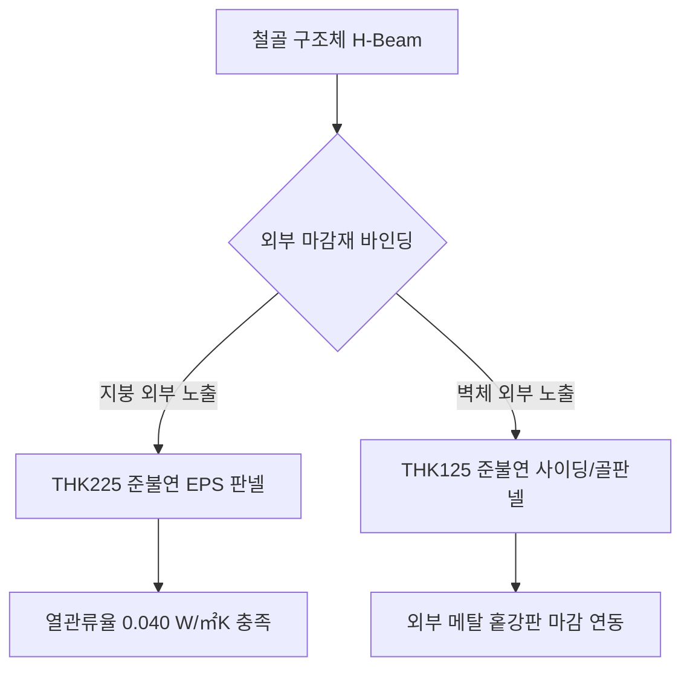

# 20. 오리엔탈 철골구조 및 EPS 패널 자재 표현 문법
(Oriental Steel Structure & EPS Panel Material Grammar Guide)

> [!NOTE]
> 본 문서는 실제 완공 및 실시설계가 완료된 **"오리엔탈 공장"** 도면의 텍스트 데이터베이스를 추출·학습하여, 지음건축(Jieum Architects)의 철골구조(S조) 및 공장 설계 시 사용되는 EPS 패널의 두께, 마감 자재, 상세 스펙을 정밀 데이터화한 지침서입니다.

---

## 1. 철골조(Steel Structure) 및 패러다임 분석

콘크리트 구조(RC)의 지음 평면 문법이 '옹벽체와 기둥'의 면적 중심이었다면, 철골조(S조)의 오리엔탈 문법은 **"EPS 판넬의 외피 두께"**와 **"철골 골조(H-Beam)의 스팬 바인딩"**이 중심이 됩니다.



---

## 2. EPS 패널 두께 및 상세 스펙 데이터 (EPS Panel Specifications)

### 1) 지붕 패널 (Roof Panel)
* **표준 두께**: **`THK 225 mm`**
* **스펙**: `THK225 EPS(준불연)(0.040W/㎡K) 판넬(지붕)`
* **물리 성능**: 열관류율 `0.340 W/㎡·K` 이하 충족
* **제도 문법**: 
  * 레이어: `@TEXT` 또는 `TXT` 레이어로 상세 스펙 기입
  * 해치 패턴: EPS 단열재를 표현하는 지그재그 또는 밀도 낮은 도트 해치 패턴 적용

### 2) 외벽 및 파티션 패널 (Wall & Partition Panel)
* **표준 두께**: **`THK 125 mm`**
* **용도별 분화**:
  * **1000골판넬**: `THK125 EPS(준불연)(0.040W/㎡K) 1000골판넬(벽)` (가장 널리 쓰이는 표준 외벽재)
  * **사이딩판넬**: `THK125 EPS(준불연)(0.040W/㎡K) 사이딩판넬(메탈 홑강판)` (의장적 효과가 가미된 외벽 마감)
  * **행거도어**: `THK125 EPS(준불연)(0.040W/㎡K) 사이딩판넬(행거도어용)`
* **색상 규칙**: 도면 내 마감 표기 시 `동우 회색` 또는 `백색`으로 마감 명칭 매핑

---

## 3. 내부 마감 및 창호 구조 표현 문법 (Interior & Glazing Grammar)

### 1) 천정재 및 경량 스터드 벽체 문법
* **사무동 천정**: `THK12 아쿠스틱 텍스` + `아연도강판 천정틀 (T-BAR 또는 CLIP-BAR)`
  * 레이어: `AZ-TEXT`, `0-AC-LEAD-TEXT` (지시선 주석 레이어)
* **내부 경량 칸막이벽**: `THK9.5 석고보드 2PLY (양면)` + `THK65 아연도 스터드 (STUD) 골조` (총 내부 파티션 두께 `103mm`)

### 2) 고급 외벽 창호 문법 (Glazing & Frame)
* **복층 유리 스펙**: **`THK24 Gray 복층유리`**
  * 세부 구성: `T5 반사유리 + T14 공기층 + T5 Gray 유리` (빛 반사율과 단열성을 모두 고려한 지음건축 표준 공장 창호 스펙)
  * 레이어: `textex` 또는 `TXT` 레이어 활용
* **기타 유리**: 내부 도어 및 고정창에는 `THK12 강화유리` 적용
* **창틀 규격**: `THK1.2 SST. FRAME (스테인리스 스틸 프레임)` 및 `THK200 AL.FRAME` 사용

---

## 4. 구조 기초 및 바닥 시스템 표현 문법 (Foundation & Floor Grammar)

* **철골 콘크리트 기초 (S.RC Foundation)**: **`THK300`** 및 **`THK600`** 철골 Concrete 기초선 표현
* **바닥 하부 단열 및 습기 방지**: 
  * `THK150 밑창 콘크리트` 및 `THK0.03 PE필름 2겹 (습기차단용)`
  * `THK90 단열재 (가등급 1호 외기에 직접 면하지 않는 바닥)`

---

## 5. AI 자동 설계 반영 지침 (AI Drafting Action Rules)

철골구조 공장 도면의 수정/확장 시 AI 엔진은 다음 두께 테이블을 즉시 연동하여 폴리라인 및 벽체 폭을 계산합니다.

```python
# 철골조 EPS 설계 시 벽체 폭 계산 예시
def calculate_wall_thickness(material_type):
    presets = {
        "exterior_wall_eps": 125,     # THK125 EPS
        "interior_partition": 100,    # THK100 그라스울 판넬 또는 경량 칸막이
        "roof_eps": 225               # THK225 EPS 지붕
    }
    return presets.get(material_type, 125)
```

이 규칙은 지음건축의 철골구조 설계에 대한 **완벽한 시각적 통합 및 자재 사양 불일치 방지**의 기준서로 작용합니다.
