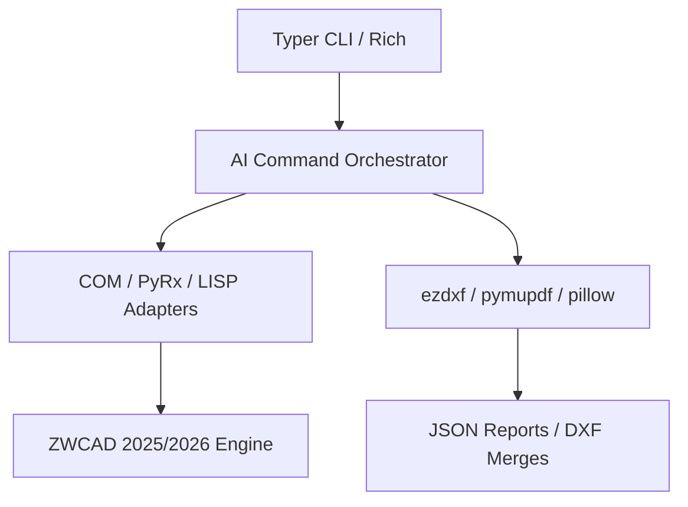

# Dependency Graph

This document details the dependencies detected within this project and their interactions.

## Package Manager

- Python `pip` (`requirements.txt`, `pyproject.toml`)

## Detected Dependencies

- `comtypes`: COM binding interface for active CAD automation
- `pywin32`: Windows API integrations for system level CAD execution
- `pydantic>=2`: Data structure parsing and schema verification
- `pydantic-settings`: Settings configuration and validation
- `python-dotenv`: Environment configuration loading
- `rich` & `typer`: CLI dashboard representation and arguments parsing
- `pandas` & `openpyxl`: CAD reports analysis and Excel exporting
- `ezdxf`: DWG/DXF programmatic parser and builder
- `pymupdf`: PDF parsing for drawing extraction
- `pillow`: OCR/image preprocessing and raster analysis
- `pyyaml`: Configuration file parsing

## Subsystem Relationships

